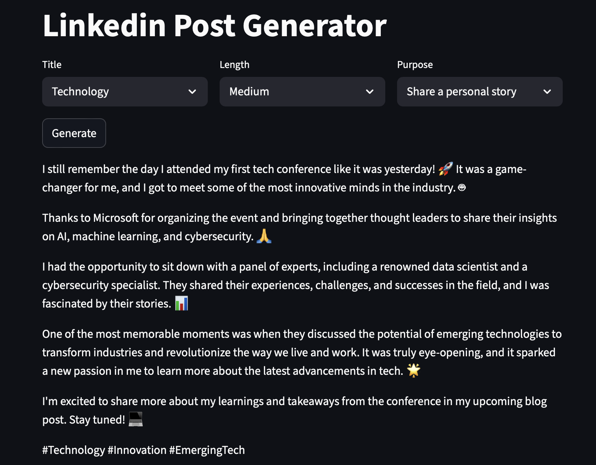

# LinkedIn Post Generator  
🚀 **AI-Powered LinkedIn Content Generator using Llama3.2 on Groq Cloud**

## 📌 Overview  
The LinkedIn Post Generator is an AI-powered tool designed to generate professional LinkedIn posts based on user-defined topics, purpose/intent, and length. It leverages **Llama3.2**, an open-source large language model deployed on **Groq Cloud**, ensuring lightning-fast inference and high-quality content generation.

---

## 🤖 Key Features

- **AI-Powered Content Generation**  
  Utilizes the Llama3.2 model for generating human-like LinkedIn posts tailored to user input.

- **Few-Shot Learning**  
  Enhances performance by incorporating a few-shot learning approach with example posts provided to the model dynamically.

- **Interactive Web Interface**  
  Built with Streamlit for quick and easy interaction with the model.

- **Customizable Output**  
  Users can select the topic, language, and post length through a clean UI with dropdown menus.

---

## 🛠️ Technical Architecture

### Frontend:
- Developed with **Streamlit** to enable a responsive and user-friendly web interface.

### Backend:
1. **Llama3.2 LLM** hosted on **Groq Cloud** for rapid inference.  
2. **LangChain** for structured prompt creation and orchestration.  
3. **Storage**: JSON-based system to store and retrieve generated posts and training examples.

### Logic Modules:
- `get_tags()` and `get_filtered_post()` functions help retrieve tags and examples to drive dropdown options.  
- `generate_post()` function handles AI inference using user-selected parameters.

---

## 🧹 Data Preprocessing

- **Tag Unification & Deduplication**  
  To enhance output quality, input data undergoes preprocessing—cleaning tags and removing duplicates before training and generation.

- **Training Dataset**  
  Model fine-tuned using a curated dataset of LinkedIn influencer-style posts.

---

## 📊 Example Use Case

1. User opens the Streamlit web app.  
2. Selects a topic, tone, language, and desired post length from dropdown menus.  
3. Clicks **Generate** to create a new LinkedIn post.  
4. Can view, copy, or save the generated content.

---

## 🧠 Few-Shot Learning Details

By dynamically inserting example LinkedIn posts into the prompt using **LangChain**, the model adapts better to specific tones, industries, and post structures over time.

## 📸 Screenshot

